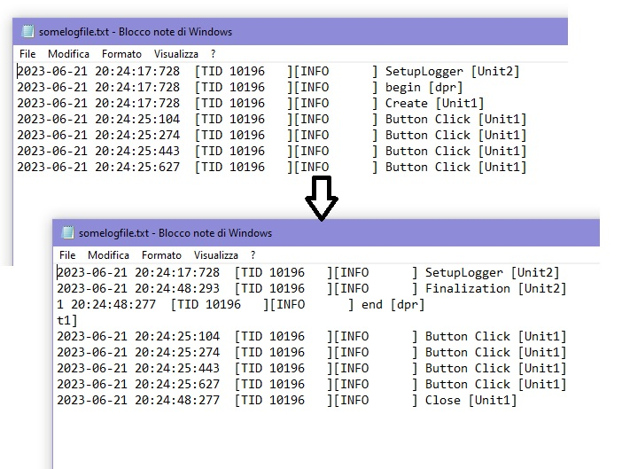

# LoggerPro test
### Testing stuff



##### Bug in <LoggerPro.FileAppender.pas>
```
procedure TLoggerProFileAppenderBase.WriteToStream(const aStreamWriter: TStreamWriter; const aValue: string);
begin
  aStreamWriter.WriteLine(aValue);
  aStreamWriter.Flush;
end;
```

##### Not sure if ok but this will fix

```
procedure TLoggerProFileAppenderBase.WriteToStream(const aStreamWriter: TStreamWriter; const aValue: string);
begin
  aStreamWriter.BaseStream.Seek(0, soEnd);
  aStreamWriter.WriteLine(aValue);
  aStreamWriter.Flush;
end;
```
